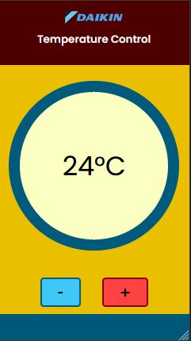
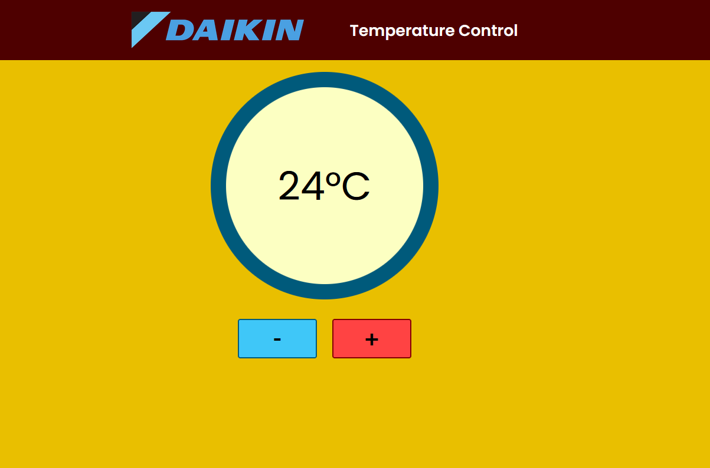

# React Temperature Control App (COMPLETE)

Single-day React project that allows you to change the temperature and changes the background depending on the temperature. A mock project for a Daikin air conditioner remote for your phone.

NOTE: This project was not commissioned by Daikin or indicative of Daikin in any way, I just own a Daikin air conditioner and decided to make a temperature control application.

### App at smallest dimensions:

## MVP

-   Create a few components that modify one another
-   A plus and minus button to modify temperature
-   Temperature displayed on screen

## Technical Info:

### Stack

HTML, SCSS, React

### Time Allowance

3 hours - took approximately 2.5 hours with all styling, design, SEO elements, responsiveness, etc.

### Hooks used

-   useState, to keep track of the temp value (largely inside Buttons and Ring components )
-   useEffect, to update the Ring component on the change of temp value (inside Ring component)

## Styling and Design:

### Colour Palette

-   Yellow and warm tones for temperature display and body
-   Blue highlights for cool temperatures, the decrease temperature button and the footer
-   Red highlights for the warm temperatures, the increase temperature button and the header.
-   White text highlights on button hover to bring attention to the button. Although this app is designed for mobile applications, the cursor is still styled as a pointer on hover.

### Responsiveness

This app was created using mobile-first development concepts. As the concept of this app is for mobile phones first and foremost, so many of the responsiveness media queries are done with 'wider than phone' and 'wider than tablet' queries.
The app is responsive down to approximately 330 px wide and 640px high (approximately the height of the Galaxy S5, and significantly narrower and shorter than the Galaxy S10, iPhone 6+ models and the Galaxy Note 10.

It also had to work for larger screens, in case someone were to access the app on a laptop, tablet or desktop.

### App at desktop dimensions:

## SEO Specs

Since in this hypothetical application, the users would be required to find this app in order to change the temperature of this application, I decided to use the opportunity to acquaint myself with more SEO concepts, including

-   title tag
-   meta tags: description, Twitter cards, viewport
-   specialised use of header tags
-   use of alt tags on all images
-   changing of title when in different tab (from Daikin Temperature Control to Change temperature)

As this is intended to be a mobile app, not only did I decide to use the mobile first design concept in terms of responsiveness, I also included the manifest.json file and got acquainted with what information to include.

## To Add

-   Request for model number and serial number
-   include this information on the page
